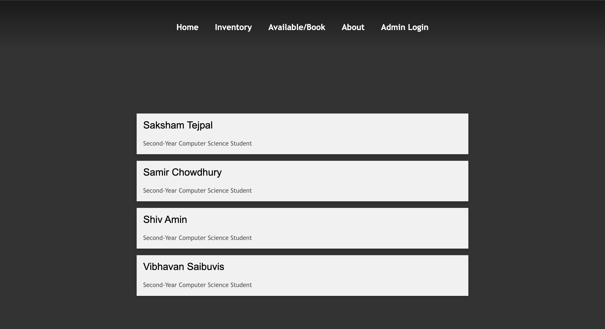
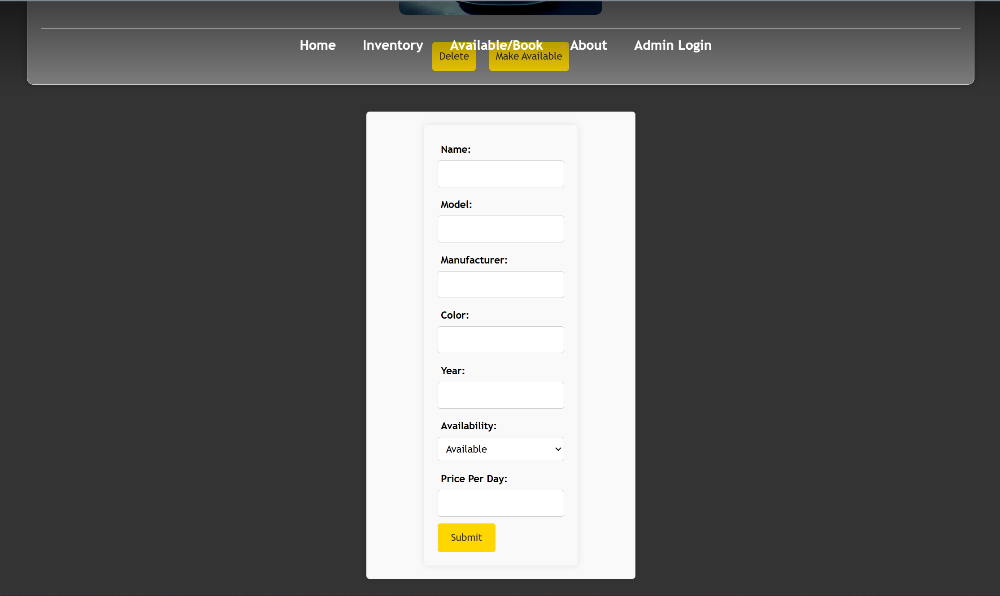

# Final Assignment - Car Rental Site
> Course: CSCI 2020U: Software Systems Development and Integration

###### By Saksham Tejpal, Samir Chowdhury, Shiv Amin and Vibhavan Saibuvis.

## Overview
This project is built to serve as a way for users to rent exotic cars in a streamlined way.
This website also has admin features which allows someone with admin credentials to be able to add and delete cars from the selection.

This an image of how the program is works

### Car Rental Features

For this Application, the following features were implemented:
- Users can browse through the inventory of cars and book one that is available.
- The website has modern elements of UI and UX with a navigation bar at the top and an on hover effect for each car.
- An aesthetic home page that has a video showcasing the cars from the catalogue
- Admin is able to log in with their password, "admin", to add and delete a car from the catalogue
- A CSV file was used as a database to store information about each car.
- Stock ID is automatically generated by the server.
- CORSEnabler was added to deal with cors related issues. 
## Dependencies
- Java Development Kit (JDK) 21 or higher
- Jakarta WebSocket API
- com.fasterxml.jackson.core
- org.json
- com.opencsv
- jakarta.enterprise
- jakarta.ws.rs
- jakarta.servlet
- org.junit.jupiter
- org.jsoup
## Steps to Run the Car Rental Website
- Clone the repository:\
  The easiest way to clone the entire project is obtaining the URL from GitHub and adding a new project from version control using this URL (IntelliJ Feature). Or you can clone the repository using Git Bash. For this, open Git Bash in your projects folder, then type the following:
  `git clone https://github.com/OntarioTech-CS-program/w24-csci2020u-final-project-amin-tejpal-chowdhury-saibuvis.git'
  Once you clone the project, load the Maven settings when the prompt appears in IntelliJ.
- Set up Glassfish Configuration:
  Select Current File near the top right of IntelliJ IDE. Press the `+` button and add a `GlassFish local server`. Ensure the fields (`URL` and `Server Domain`) in the Configurations pop-up match below:\
  
   
  Navigate to the `Deployment` tab, and choose the artifact to be deployed as seen below.
   
  
  Now you are all set to run the `GlassFish Server`.
- After you run the server, the `carRentalClient` artifact is deployed which runs the `HTML` file in a browser (Microsoft Edge is recommended).\
  
  If you are not able to view the `HTML` file by default, just run the `index.html` file from IntelliJ when the server is running.
- Next you can browse through the catalogue of cars available for rental and book accordingly.
  
- You can also visit the `About` page to learn more about the collaborators on this project.
- You are more than welcome to contribute and customize this project. Fork the repository, make your changes, and submit a pull request if you want to contribute back to the project.

## Car Rental Endpoints
- All endpoints for CarResource is under "cars".
- Within it, the first endpoint is "all" which displays all cars
- Second endpoint is "available" which displays only the available cars
- Third endpoint is "book" which allows the user to book a car they want to rent
- Fourth endpoint is "makeAvailable" which allows the admin to make a car available for a user to book
- Fifth endpoint is "delete" which allows the admin to delete a car from the list 
- Sixth endpoint is "addCar" which allows the admin to add a car to the list

### Future Improvements
- We can optimize the server performance to be able to handle larger volumes of concurrent users and messages.
- Include features to allow the admin to share media like images of the cars they would like to list for rental.
- It is possible to add features to allow users to rent for a certain amount of time.
- Pricing options can also be added to give users more options on how they would like to go about their rental.
- Implementing an actual database to enhance the website's performance by efficiently organizing and retrieving data, including images, 
  which would reduce response times and improve scalability.
- Feature that allows user to book a car depending on their location

### Screenshots 
- Home Page

- Inventory Page

- Available Page

- About Page

- Admin Page

- Admin Adding Car

- Car Being Added

### Contribution Report

- Saksham Tejpal : 25%
- Samir Chowdhury : 25%
- Shiv Amin : 25%
- Vibhavan Saibuvis : 25%

